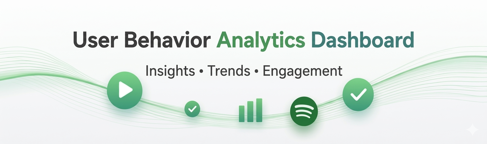
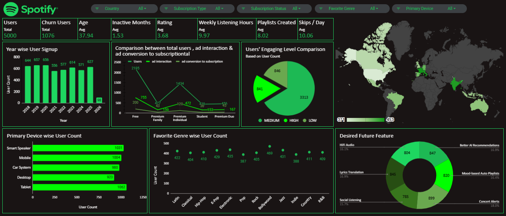

# Spotify User Behavior & Pattern Analysis

## Project Overview
This project focuses on analyzing user behavior and engagement patterns on Spotify using an interactive data dashboard. The objective was to extract actionable insights to improve user retention, optimize subscription strategies, and enhance overall user experience.
The dataset includes key attributes such as user demographics (age, country), subscription type and status, listening habits, engagement metrics (listening hours, playlists created, skips), and inactivity trends. Using Google Sheet/Excel, the data was cleaned, transformed, and visualized into a dashboard.

## File Details
- **Filename:** `SpotifyDataAnalysis.xlsx`
- **Total Records:** `5000`
- **Primary Keys:** `country`,`subscription_type`,`subscription_status`,`favorite_genre`,`primary_device`
- **Source File Link:** https://www.kaggle.com/datasets/sahilislam007/spotify-user-behavior-and-pattern

## Data Dictionary

| Column Name | Description | Data Type |
| :--- | :--- | :--- |
| **user_id** | Unique identifier assigned to each user in the dataset. | Integer |
| **country** | Country where the user is located. | String |
| **Age** | Age of the user | Integer |
| **signup_date** | The date when the user signed up for the platform. | Date |
| **subscription_type** | Type of subscription used by the user. | String |
| **subscription_status** | Indicates whether the user currently has an active or inactive subscription. | String |
| **months_inactive** | Number of months the user has been inactive on the platform. | Integer |
| **inactive_3_months_flag** | Binary indicator showing whether the user has been inactive for 3 months or more. 1 = Inactive for 3+ months , 0 = Otherwise | Boolean |
| **ad_interaction** | Indicates whether the user has interacted with advertisements on the platform. | Boolean |
| **ad_conversion_to_subscription** | Indicates whether an advertisement resulted in the user converting to a paid subscription. | Boolean |
| **music_suggestion_rating_1_to_5** | User rating (1–5 scale) for the platform's music recommendation system. 1 = Very poor recommendations 5 = Very good recommendations | Integer |
| **avg_listening_hours_per_week** | Average number of hours the user spends listening to music per week. | Float |
| **favorite_genre** |The music genre most frequently listened to by the user. | String |
| **most_liked_feature** | The feature that the user likes the most on the platform. | String |
| **desired_future_feature** | Feature the user would like to see added or improved in the future. | String |
| **primary_device** | Main device used to access the music platform. | String |
| **playlists_created** | Number of playlists created by the user. | Integer |
| **avg_skips_per_day** | Average number of songs skipped by the user per day. | Integer |
| **engaging_score** | Users’ engagement with spotify in terms of some values. | Float |
| **engaging_level** |Users’ 3 different engagement level with spotify. | String |
| **Country wise User** | For map chart calculation purpose. | Integer |

## Key Insights & Statistics
- **Stable User Growth-** Yearly signups were consistent (approx 550–660 users per year). Only in year 2026, there was a drop in user signup counts mainly because of shortage of data.
- **High Churn Rate (21.5%)-** 1076 out of 5000 users detach from Spotify and users’ average months of inactivity is high which also indicates detachment from spotify.
- **Subscription Type Domination & Weak Conversion-** Free users are high in number(2195) .But conversion to paid is very low. Users enjoy the platform but don’t see enough value to upgrade.
- **Poor Music Recommendation-** Avg Skips/Day = 10+ , Avg Music Suggestion Rating = Less than 4
- **Engagement Level-** High=841 users, Medium=3313 users(majority), Low=846 users
- **Diversified Genre Preference-** No extreme dominance of any genre 
- **Geographic Coverage-** Number of users across the mentioned countries are almost balanced.
- **Device Used-** No such dominance of any primary device is observed.

## Future Suggestions
- **Improve conversion:** Give Free trials of premium subscription for 7-15 days and review the subscription amount again.
- **Reduce churn:** As low engaging users are most likely to detach from the platform , introduce a Re-engagement campaigns specially for them. Start to track and send notification mails to the inactive users.
- **Launch top features:** Concert alerts, AI recommendations first.
- **Target Medium engaging users:** Push toward high engagement by providing them personalized playlists and better music recommendation .

## Focus Outcomes
- Reduce churn
- Increase premium subscription conversion
- Enhance user satisfaction 

## Dashboard Image

## Data Cleaning Notes
-	**Formatting-** Custom number formatting of `signup_date` column into `yyyy` and renamed the column to `signup_year`.
-	**Add column-** Insert new columns for various type of analysis purpose. 

---
